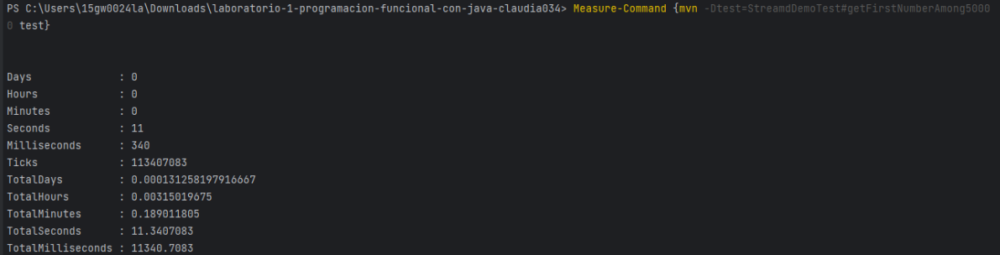
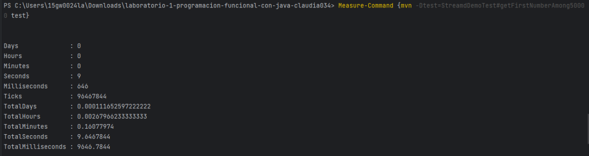

Utilizando el comparador de tiempos en PowerShell con el Measure-Command se realizó primero el test de ejecución serial y luego paralela,
en la primera ejecución la máquina fue capaz de realizarlo en un tiempo de 11 segundos, en el segundo test se ejecutó en 9 segundos, con
una diferencia de 2 segundos.

¿Se mejora el tiempo? ¿Por qué?
Sí, se mejora.
Al realizarse de manera serial, se van ejecutando una tras otra, esto hace que el proceso sea lento, en cambio,
si se realiza de manera paralela, las tareas se van dividiendo y se ejecutan de manera simultanea, esto hace que se
aprovechen de mejor manera los recursos, por lo cual, considero que la mejor opción es la paralela ya que al dividirse y ejecutarse las tareas,
tiende a ser más rápida, en cambio, la ejecución paralela puede tornarse compleja dependiendo de la cantidad de datos que le estemos pidiendo que ejecute.
Considero que la elección entre paralelo y serial dependera de la complejidad del problema, los recursos del procesador, el rendimiento y la escabilidad.

Test en serial:

Test en paralelo:
